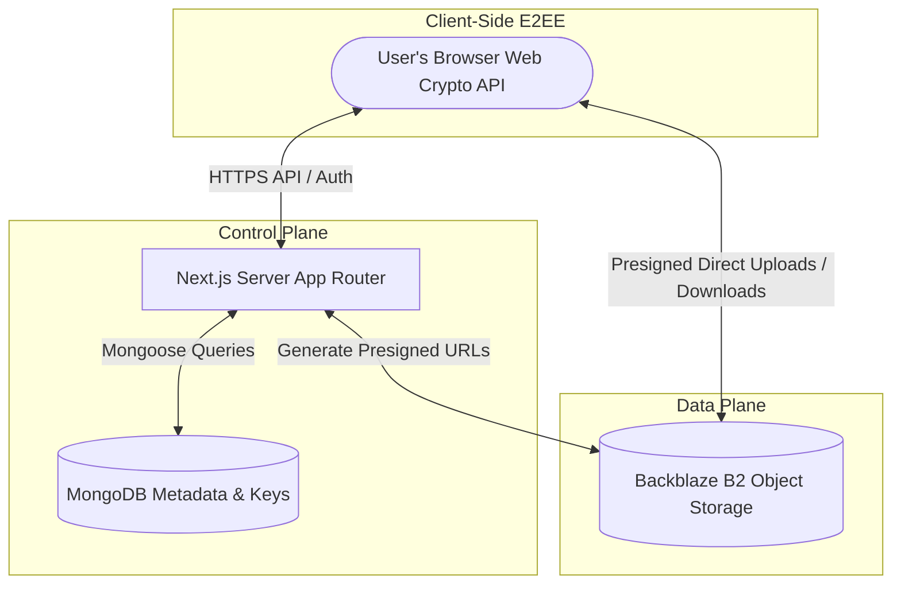
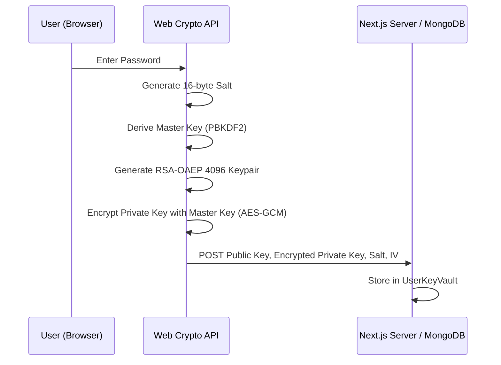
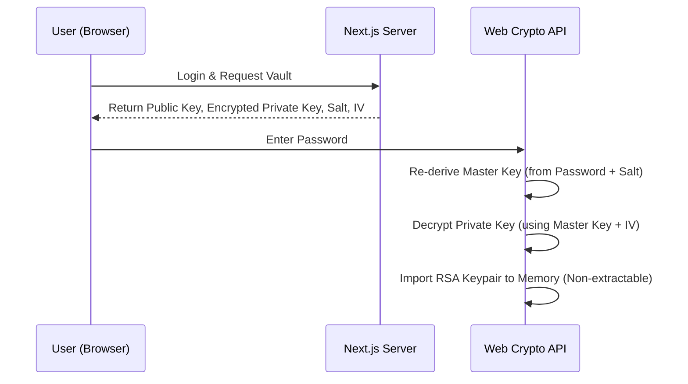
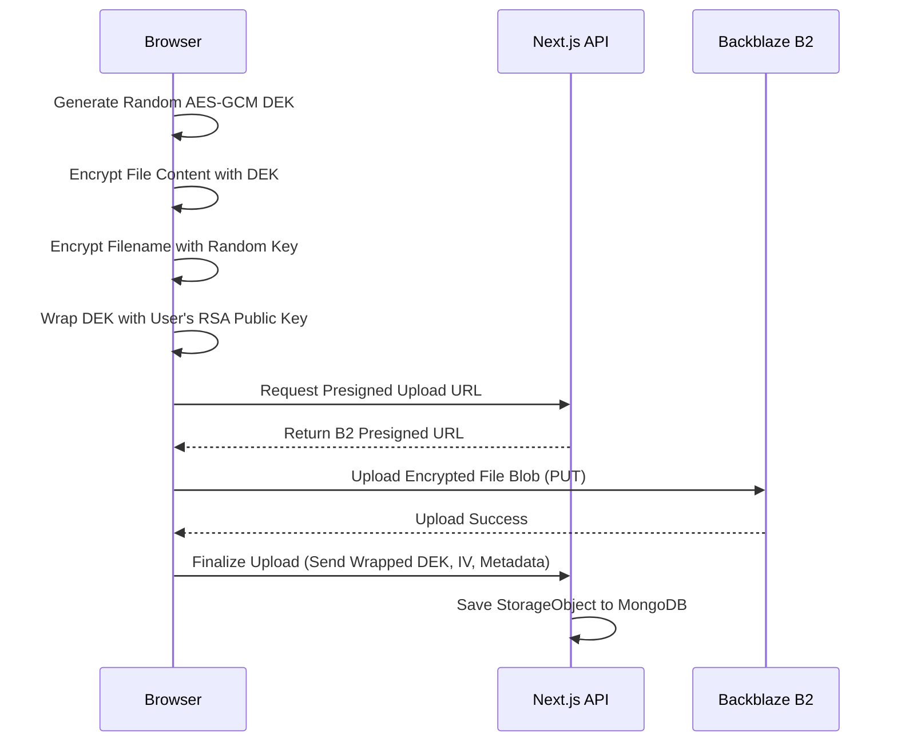
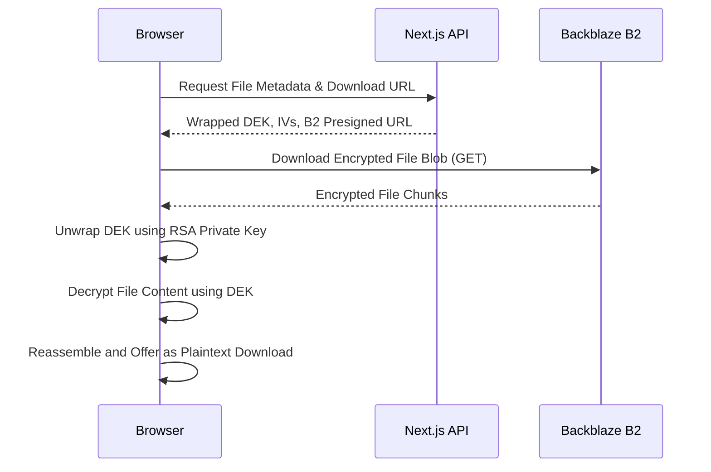
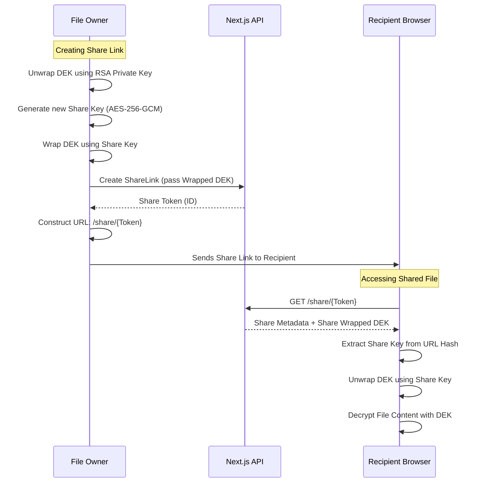

# Xenode

Xenode is a modern, privacy-first, **End-to-End Encrypted (E2EE)** decentralized cloud storage platform. Built with Next.js, it offers highly secure file storage, bucket management, and secure sharing capabilities. The core philosophy of Xenode is **Zero-Knowledge**: user data remains entirely private, and the server administrators cannot access the plaintext content of stored files or passwords.

---

## 🚀 Built With

- **Frontend & Backend**: Next.js 15 (App Router), React 19
- **Styling & UI**: Tailwind CSS v4, Shadcn UI, Radix UI, Framer Motion
- **Authentication**: Better Auth with Bcrypt
- **Database**: MongoDB with Mongoose
- **Storage**: Backblaze B2 (AWS S3-compatible API)
- **Encryption**: Web Crypto API (Client-Side AES-256-GCM & RSA-OAEP 4096)
- **Uploads**: Uppy (chunked & multipart direct-to-S3 uploads)

---

## 🏗️ System Architecture

Xenode strictly separates the **Control Plane** (authentication, metadata, and encryption keys) from the **Data Plane** (actual file blobs).

1.  **Metadata & Keys (MongoDB)**: Stores user accounts, bucket definitions, file metadata (size, content type, tags), share links, and user key vaults.
2.  **Object Storage (Backblaze B2)**: Stores the actual file blobs. All files are completely opaque encrypted ciphertext. Backblaze only sees encrypted streams of generic byte data.
3.  **Client-Side Execution**: All cryptographic operations (hashing, key derivation, encryption, decryption) happen natively in the user's browser using the Web Crypto API. The server _never_ sees plaintext files or the user's private keys.



---

## 🔒 End-to-End Encryption (E2EE) Deep Dive

Xenode uses a hybrid encryption architecture (Symmetric AES + Asymmetric RSA) to provide seamless E2EE without forcing the user to manually manage keys, while still allowing secure file sharing.

### 1. Key Generation & Vault Setup

When a user initially registers or sets up their vault, their browser generates a master identity.



- **Master Key Derivation**: A 16-byte random salt is generated. A `Master Key` is derived from the user's password and salt using `PBKDF2`.
- **RSA Keypair Generation**: An `RSA-OAEP 4096-bit` keypair (`Public Key` and `Private Key`) is generated in the browser.
- **Vault Protection**: The private key is exported and encrypted using `AES-256-GCM` with the derived `Master Key`.
- **Storage**: The plaintext `Public Key`, the `Encrypted Private Key`, the PBKDF2 salt, and IV are stored in MongoDB (`UserKeyVault` collection).

### 2. Unlocking the Vault (Login)

On subsequent logins, the vault must be unlocked locally.



- The encrypted vault is retrieved from the server.
- The `Master Key` is re-derived from the provided password and stored salt.
- The `Master Key` decrypts the `Private Key` in memory.
- Keys are imported into the browser session as **non-extractable CryptoKey objects**, ensuring they cannot be easily leaked by rogue scripts securely retaining the state locally.

### 3. Encrypting & Uploading a File

Files are encrypted directly before being streamed to the storage provider.



- **DEK Generation**: A random, file-specific `Data Encryption Key (DEK)` (AES-256-GCM) is generated.
- **File Encryption**: The file content is encrypted in the browser using the `DEK`.
- **Filename Encryption**: The original filename is also encrypted.
- **DEK Wrapping**: The `DEK` itself is encrypted (wrapped) using the user's `RSA Public Key`.
- **Upload**: The encrypted file blob is uploaded directly to Backblaze B2 via presigned URLs. The server only receives metadata, the wrapped DEK, and IVs.

### 4. Downloading & Decrypting a File

Downloading a file naturally reverses the upload process.



- The client requests metadata yielding the wrapped DEK and an authorized presigned URL for Backblaze B2.
- The browser unwraps the DEK using the user's unlocked `RSA Private Key`.
- The encrypted file blob is acquired from Backblaze B2.
- The file is decrypted locally using the un-wrapped `DEK`.

### 5. Secure File Sharing

Sharing an encrypted file without leaking the private key is handled via unique "Share Links".



- The owner's client decrypts the file's `DEK` using their Private Key.
- A new, random `Share Key` (AES-256-GCM) is generated.
- The `DEK` is re-encrypted using this `Share Key`.
- The server saves the share link metadata, including this `shareEncryptedDEK`.
- **The Magic:** The `Share Key` is appended to the shareable URL fragment (e.g., `#key=...`). URL fragments are _never_ sent to the server.
- When a recipient opens the link, the client code extracts the `Share Key` from the URL, decrypts the `DEK`, downloads the encrypted file, and finally decrypts the payload locally.

---

## 📂 Codebase Structure

- **/app**: Next.js App Router endpoints, pages, and API routes.
  - `/api`: Backend endpoints (metadata, Better Auth, share link generation, presigned URLs).
  - `/(dashboard)`: The main authenticated application (file explorer, buckets, settings).
- **/components**: Reusable UI components (buttons, dialogs, form inputs, encrypted file previewers, drag-and-drop).
- **/contexts**: React Contexts managing complex global state.
  - `CryptoContext.tsx`: Manages in-memory keys, vault unlocking, caching via IndexedDB.
  - `UploadContext.tsx` / `DownloadContext.tsx`: Manage E2EE streaming, chunked uploads, and download decryption progress.
- **/lib**: Application logic and utility functions.
  - `/crypto`: Core cryptographic logic (`fileEncryption.ts`, `keySetup.ts`, `keyCache.ts`, `utils.ts`).
- **/models**: Mongoose schemas defining the data layer (`StorageObject`, `Bucket`, `UserKeyVault`, `ShareLink`, `Usage`).

---

## 💾 Database Schema (MongoDB / Mongoose)

The backend utilizes MongoDB to map files naturally and securely.

1.  **User (`Better Auth Schema`)**: Stores basic account metrics, email, password hashes, and sessions.
2.  **UserKeyVault**: Stores strictly symmetric encrypted PKCS#8 `encryptedPrivateKey`, SPKI `publicKey`, PBKDF2 salt, and IV parameters tied explicitly to one User ID.
3.  **Bucket**: A localized logical container grouping files with distinct identifiers mapping safely back to underlying Backblaze B2 buckets.
4.  **StorageObject**: Detailed map to individual B2 blobs, recording their `content-type`, bucket associations, size, unique object keys, tag assignments, and E2EE parameters (`isEncrypted`, `encryptedDEK`, `iv`, `encryptedName`).
5.  **ShareLink**: Temporary or permanent links, mapped tokens, expiration dates, link-specific `shareEncryptedDEK`, and access type permissions (`view` / `download`).

---

## 🛠️ Setup Instructions

### Prerequisites

- Node.js (v18+ recommended)
- MongoDB instance (Local or Atlas)
- Backblaze B2 account

### Environment Variables

Copy `.env.example` to `.env.local` and populate the following secrets:

```env
# Database
MONGODB_URI=your_mongodb_connection_string

# Better Auth
BETTER_AUTH_SECRET=your_secret_key
BETTER_AUTH_URL=http://localhost:3000

# Backblaze B2 (S3 API)
S3_ENDPOINT=your_b2_s3_endpoint
S3_REGION=your_S3_REGION
S3_APPLICATION_KEY_ID=your_key_id
S3_APPLICATION_KEY=your_app_key
S3_BUCKET_NAME=your_S3_BUCKET_NAME
```

### Running Locally

1.  **Install dependencies**:

    ```bash
    npm install
    # or pnpm / yarn
    ```

2.  **Start the development server**:

    ```bash
    npm run dev
    ```

3.  Open [http://localhost:3000](http://localhost:3000) with your browser to experience the application.

---

## 📜 License

Private Project / All Rights Reserved.
