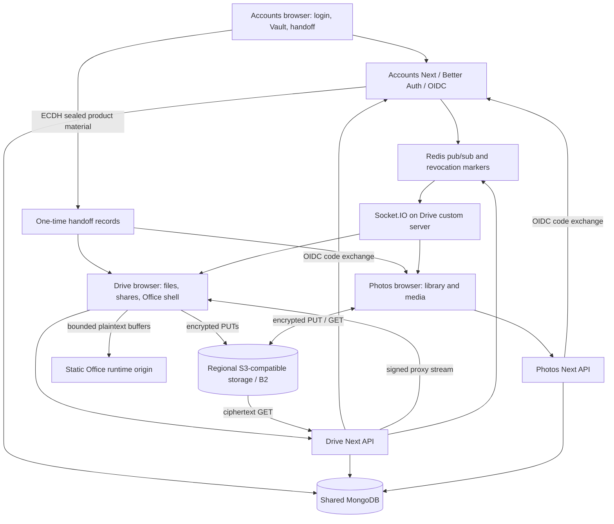

# Current implemented architecture

## Repository and runtime

The root `package.json` defines npm workspaces (`apps/*`, `packages/*`) and Turbo orchestration. Root `dev` starts only Drive; `dev:all` starts all applications. Accounts runs on 3001, Drive on 3000, Photos on 3002. Source is TypeScript/React/Next.js. Drive uses a custom `server.mjs` to host Socket.IO alongside Next; Accounts and Photos use ordinary Next commands.

The inventory contains 923 first-party `.ts`, `.tsx` and `.mjs` files under apps/packages, excluding public assets. There are 230 route-handler files under app directories, including auth handlers outside `/api`. These counts establish scope, not line-by-line verification of every source file.

The diagram describes implemented flows. In particular, Drive downloads do pass through Next. `lib/b2/objects.ts:getDownloadUrl` delegates to `getSignedFileUrl`; `app/api/files/[bucket]/[...key]/route.ts:GET` streams S3 `GetObject`. This contradicts the direct-download wording in `docs/ARCHITECTURE.md` (F19).

## Packages and actual scope

| Package | Actual responsibility | Boundary judgment |
| --- | --- | --- |
| `contracts` | Product/Space IDs, API/event contracts and schemas | **KEEP** portable contracts |
| `config` | Product registry, origins, selected server validation, regional S3 config | **KEEP / FIX** startup and deployment coverage |
| `database` | Shared connection; Vault/profile/product-session/handoff/Space/Photos target models; account/logout repositories | **KEEP / MIGRATE** Drive domain models remain local |
| `identity-core` | PKCE, return-path sanitization, first-party clients, signed product cookies; additional validation helpers | **KEEP**; production code/token issuance belongs to Better Auth |
| `spaces` | Personal/org/team membership resolution, role helper, canonical product-key records | **KEEP / FIX** callers must assert actions |
| `crypto-core` | AES-GCM envelopes with context AAD, HKDF, Argon2 parameter checks, recovery and device wrapping | **KEEP** primitives; secret selection is unsafe at the app layer |
| `crypto-react` | Product key context plus IndexedDB persistence | **FIX** memory-only contract and lifecycle race protection |
| `key-handoff` | ECDH P-256 + HKDF + AES-GCM transport, binding and client replay checks | **KEEP**; harden server consume consistency |
| `upload-engine` | Queue, concurrency, retry, cancellation, policy and checkpoint interfaces | **KEEP / MIGRATE** concrete adapters remain in apps |
| `photos` | Asset/album repository interface, projection dedup, cursor pagination, media policy | **KEEP** domain scope |
| `media-processing` | MIME guard, chunk planning, basic MP4 box helpers, metadata interface | **MIGRATE** real processing remains app-specific |
| `realtime` | Ticket/event/room/revocation contracts and helpers | **KEEP / FIX** Node socket implementation duplicates validation |
| `ui` | Shared shadcn/Tailwind primitives and theme provider | **KEEP**; Drive retains local primitives |
| `eslint-config`, `tsconfig` | Shared tooling defaults | **KEEP** |

## Data ownership and persistence

`packages/database/src/connection.ts` provides a process-cached Mongoose connection, raw database access, and transaction helper. Drive's `lib/mongodb.ts` is a thin wrapper, not a second client. A separate logs connection is intentional. Better Auth uses singular `user`, `account`, `session` and plugin collections; custom raw queries must preserve its `_id` and foreign-key conversions.

`Space` is modeled as personal, organization or team, with ownership/membership resolved by `packages/spaces/src/authorization.ts`. Physical buckets are **regional shared infrastructure**, not per-user authorization boundaries. `bucketOwnershipClause` selects a shared regional `systemKey: drive` bucket. Object authorization must therefore use `spaceId`, product and action independently. F07/F08/F11 expose remaining places where legacy bucket ownership assumptions survive.

Drive retains local models for `StorageObject`, `Bucket`, `Usage`, subscriptions/payments, shares, comments, org policies and admin. Photos uses `PhotoAsset` and `PhotoAlbumV2` from the database package but inserts storage records through raw `storageobjects` queries. Drive's StorageObject query middleware excludes Photos rows for normal find/update/delete/count calls; it does not automatically protect aggregation, raw collection access, or S3 operations.

## State, caching and asynchronous work

- Drive: React contexts for crypto/uploads/downloads/workspace/previews; React Query and realtime invalidation; Dexie per-user metadata/upload journals; RAM MiniSearch; Cache Storage ciphertext downloads/previews; RAM decrypted thumbnails; browser crypto/metadata workers and media service-worker routing.
- Photos: component state, cursor pagination, ciphertext Cache Storage, product-key context and session probe/revocation guard. Browser uploads use memory-only queue checkpoints.
- Accounts: server-rendered hub data plus browser Vault/PRF operations; cached ARK and browser device wrapping keys in IndexedDB; staged password mutation stored in `UserVault`.
- Server jobs: authenticated HTTP cron, not a deployed worker fleet. Redis carries realtime fan-out, ticket replay and revocation state. `lib/migrations/redis.ts` and stream-upload helpers are residual code, not evidence of a working BullMQ migration service.

## Configuration and external services

All Next configs load the root `.env.local`. Environment names cover Mongo, separate logs, Redis, per-product origins/cookie secrets, Better Auth, WebAuthn origins, S3 Asia/US/EU endpoints and credentials, email, Razorpay, PostHog and renderer flags. Values of local secret files were not inspected or copied.

The configured label `asia` is not proof of physical residency: the default storage schema points to B2 `us-west-004`. All regions can fall back to the same default endpoint/bucket when names are absent; credentials are checked on use. **FIX** region provisioning checks and uniqueness before advertising residency (F29).

Mail, Calendar, Notes, Tasks, Contacts and Messages have no application workspaces here. `v2_ml_plan.md` documents client-side AI ideas; source searches found no corresponding inference pipeline or content-to-cloud-AI integration. This is planned platform scope, not shipped functionality.
