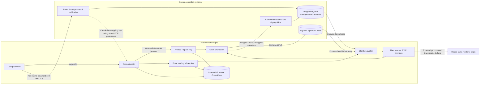

# E2EE security and trust boundaries

## Verdict

The repository contains real client-side encryption and good envelope/transport primitives, but **the stated server-blind E2EE model does not currently hold**. F01 defeats the root-key boundary without breaking cryptography. Additional conflicts concern durable key capability, metadata, endpoint authorization and file-runtime deployment.

The audit found no server route intentionally returning a raw ARK and no active cloud-AI content processing in the reviewed source. Those positive observations do not negate the server's ability to derive the ARK from the password it receives.

## Trust-boundary diagram

The dashed edge is an ability, not a claim that the server currently performs decryption. An adversarial or instrumented auth server already receives the required secret. The IDB edges represent persistent usable capabilities even though `extractable:false` prevents exporting key bytes through WebCrypto.

## Data-flow trace

| Flow | Client plaintext/encryption | Network/API/database or storage | Retrieval/decryption | Boundary judgment |
| --- | --- | --- | --- | --- |
| Vault password | Login form → Argon2id in browser | Same string also sent to auth/unlock; salt and envelope persisted | Client opens ARK | **CRITICAL F01** |
| Recovery phrase | BIP39 words and derived secret generated locally; recovery PDF generated locally | Recovery envelope only in intended Vault payload | Broker/add-password decrypt locally | **KEEP**; lost-login workflow incomplete |
| Browser device | Random non-extractable wrapping key locally | Device envelope stored server-side; wrapping key in IDB | Browser device envelope opens ARK | **FIX F02** trust/lifetime policy |
| Passkey | Authenticator PRF output → HKDF wrapping key | WebAuthn public credential and encrypted device envelope | Local PRF opens ARK | **KEEP** primitive, **FIX F03** integration |
| Product handoff | Accounts unwraps PSK; Drive bundle also contains RSA material | ECDH/HKDF/GCM sealed transport; one-time DB record | Destination private key opens bundle | **KEEP** origin/account/product/Space binding |
| Drive personal file | Per-file AES-GCM; DEK RSA-wrapped; metadata purpose key | Browser PUT ciphertext; API stores wraps, IVs, encrypted metadata plus operational fields | Drive unwraps with RSA key and decrypts | **MIGRATE** to explicit versioned product file format |
| Drive org file | AES-GCM DEK/content; raw Space key wraps DEK and encrypts metadata | Ciphertext plus version/wrap IV | Hook currently selects newest grant | **FIX F18** rotation and purpose separation |
| Photos media | Distinct DEKs for original/optimized/thumbnail; account/Space/key AAD | Direct ciphertext; raw type/date/dimensions remain | Local decrypt from signed direct GET/cache | **KEEP** crypto; **FIX F14** CSP |
| Photos album | User-entered text, no encryption call | Submitted and persisted as `encryptedName` | Placeholder album UI | **HIGH F15** |
| Public share | Random fragment key wraps DEK/metadata | Server sees token, policy and encrypted material; optional bundle title plaintext | Browser fragment key decrypts | **KEEP** key path; **MIGRATE F25** private titles |
| Office edit | Plaintext only in browser/runtime; fresh IV for encrypted save | Server receives ciphertext update body and stores it | Version loads/decrypts in browser | **KEEP** crypto/CAS; proxy violates direct-byte architectural constraint |
| Local search | Names decrypted into RAM MiniSearch | Dexie mainly holds encrypted names; upload journal holds actual filename | RAM search | **FIX F17/F20** journal privacy and cursor |

## Key generation, storage, transmission and cleanup

`crypto-core/envelope.ts` authenticates account, optional Space/product, key ID/version/type in AAD and checks expected context. `key-handoff` uses P-256 ECDH, SHA-256 HKDF, random 96-bit GCM IVs and binding AAD. Its client and server checks cover one-time use and expiry. Accounts stores only transport ciphertext. Drive explicitly checks the destination fingerprint on consumption; Photos has corresponding consumer checks. **KEEP** these mechanisms.

`ProductCryptoProvider.unlock` imports non-extractable AES keys, zeroes the raw return buffer, then saves the CryptoKey in IndexedDB. Accounts separately persists its ARK; Drive persists sharing-private, sharing-public and metadata keys. Browser device and pending redirect handoff stores are distinct. Pending ephemeral persistence is short-lived transport state; it must not be conflated with indefinite product-key caching. **FIX F02** the latter according to the memory-only requirement.

The key cache is indexed by product/Space, not session or key version. `restore`/`unlock` have no generation fence against `lock`; a delayed async result can reinstall a key after lock begins. Persistence operations resolve on request success rather than transaction completion, and deletion treats blocked/error as success. **FIX** deterministic lock semantics with browser tests; a reload after best-effort deletion is not proof of erasure.

Org key handling remains a separate raw `Uint8Array` hook. It neither zeroes discarded raw arrays nor derives the metadata purpose key with shared HKDF. Retirement selects new grants without preserving a normal old-version decryption path. **FIX F18** while retaining old ciphertext compatibility.

## What the server learns

| Data | Actual visibility |
| --- | --- |
| File bytes | Normally ciphertext; personal APIs still allow unencrypted declarations and arbitrary PUT MIME/key choices |
| Filenames/folder display names | Encrypted by primary Drive UI; accepted plaintext through permissive server contracts; upload journal keeps filename locally |
| Album names | Standalone Photos input is persisted unchanged; Drive albums are a separate implementation |
| EXIF/GPS and detailed metadata | Drive worker results encrypted in `encryptedMetadata`; standalone Photos does not implement equivalent EXIF extraction |
| Date/type/dimensions | Photos persists exact date, width/height and original MIME; Drive persists type/category, dates/aspect ratio |
| Descriptions/source URLs | Legacy Drive update-metadata writes plaintext |
| Relationships | Space/account IDs, folder key hierarchy, album membership, sharing recipients and timestamps visible |
| Search | Primary Drive index in memory; no active cloud search/inference path found |
| Logs/analytics | PostHog allowlists event/property names and sanitizes URLs; API logs retain status, IP, user agent and error text; raw console errors are not equivalently sanitized |

**MIGRATE** sensitive user-authored text to authenticated encrypted envelopes. **KEEP** the operational metadata needed for routing/quota only after making the exposure explicit. A field name beginning with `encrypted` is not evidence that a caller encrypted its value.

## Authentication and hostile-origin boundaries

User ProductSessions reject wrong product, expiry, revocation and stale signed-cookie version in their normal resolvers. Accounts custom MFA/unlock checks are not uniformly applied (F04); handoff server consumption uses a bare session ID and does not apply every signed-cookie resolver check. **FIX** consistency without putting raw keys into API authorization tokens.

Drive's proxy rejects API calls from hostile same-site renderer origins, and application routes return 404 on edit/preview hosts. OnlyOfficeParentBridge checks exact origin, source window, protocol, nonce and buffer bounds. **KEEP** those controls. However, the checked-in static deployment does not serve the actual artifact tree and permits the old parent host; Drive's broad CSP is report-only. SafePdfPreview loads PDF.js into the trusted application realm, so a worker alone is not a separate-origin security boundary. **FIX F22/F23** and verify actual browser-hosted rendering with the corpus.

## Required security validation

**FIX** with executable tests for: server-observed password independence; no product-key persistence; lock-vs-restore races; cross-account/product/Space ciphertext substitution; guest mutations; key rotation with existing files; stage/commit crash recovery; unauthorized-origin WebSockets; malicious file rendering; and no plaintext in outbound payloads/logs. Existing primitive tests should remain, but they cannot prove these composed properties.

Threat-model limit: any web E2EE product still trusts the code delivered to its browser origin. This audit distinguishes that general limitation from F01, where the normal protocol already sends the decryption secret to the server without requiring malicious JavaScript delivery.
