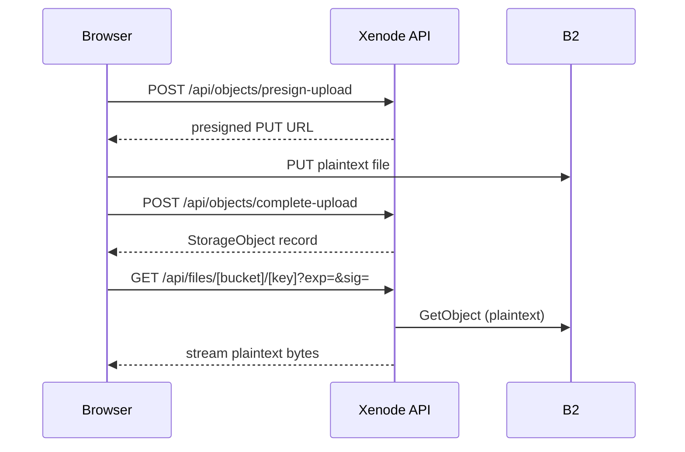

# End-to-End Encrypted File Storage — Full Design Document

> **Goal**: Make Xenode a zero-knowledge storage platform. The server and Backblaze B2 see only ciphertext. Not even the platform owner can read user files.

---

## 1. Current Architecture (Today)



| Layer | Status |
|-------|--------|
| Files in B2 | ✅ TLS in-transit · ❌ plaintext at-rest |
| CDN proxy | ❌ server reads plaintext before streaming |
| Filenames in MongoDB | ❌ plaintext |
| Platform owner / B2 admin | ❌ can read all files |

---

## 2. Can the Bucket / Platform Owner See Files?

**Today — yes.** The server holds `B2_KEY_ID` + `B2_APPLICATION_KEY` and can call `GetObjectCommand` on any file.

**After E2EE — no.** Everything the server stores is locked by a key it never has:

```
Server has:           Can it help?
  ciphertext in B2 ──────────► 🔒 need DEK
  encryptedDEK ─────────────► 🔒 need user private key
  encryptedPrivateKey ───────► 🔒 need master key
  pbkdf2Salt ────────────────► 🔒 need user's password
  user's password ───────────► ❌ NEVER reaches server
```

> [!IMPORTANT]
> **Web app caveat**: A malicious server could ship tampered JavaScript that exfiltrates plaintext. Mitigations: Subresource Integrity (SRI) on JS bundles, open-source code, or a native app where code is not runtime-served.

---

## 3. Cryptographic Model

### 3.1 Primitives

| Purpose | Algorithm |
|---------|-----------|
| File encryption | **AES-256-GCM** (authenticated, Web Crypto built-in) |
| Key wrapping | **RSA-OAEP 4096-bit** (asymmetric, enables file sharing) |
| Password → master key | **PBKDF2-SHA256** (600,000 iterations) |
| Per-file key | Random 256-bit via `crypto.getRandomValues` |

### 3.2 Key Hierarchy

```
User Password  +  pbkdf2Salt (stored in DB)
        │
        ▼  PBKDF2
  Master Key (AES-256-GCM, ephemeral — never stored)
        │ wraps
        ▼
  Private Key (RSA-4096 PKCS#8) ◄─────── Public Key (stored plaintext in DB)
        │ decrypts                                │ encrypts
        ▼                                        ▼
  File DEK (random AES-256-GCM, per file)  encryptedDEK (stored in DB)
        │ encrypts
        ▼
  Ciphertext blob stored in B2
```

---

## 4. Multi-Device & Cross-Platform Access

### 4.1 New Browser / New Device (Web)

The encrypted private key lives on the server as a safe carrier. Any device can unlock it with the password:

```
New device
  1. POST /api/auth/login  → session established
  2. GET  /api/keys/vault  → { encryptedPrivateKey, pbkdf2Salt, iv }
  3. Prompt: "Enter your encryption password"
  4. Browser: PBKDF2(password, salt) → masterKey
  5. AES-GCM decrypt(encryptedPrivateKey, masterKey, iv) → privateKey (CryptoKey)
  6. All files now decryptable — same result on every device
```

### 4.2 Session Key Storage (In-Browser)

| Strategy | Safety | Survives Refresh? |
|----------|--------|-------------------|
| React Context (in-memory) | ✅ Best | ❌ No — re-prompt on refresh |
| IndexedDB (`extractable: false`) | ✅ Good | ✅ Yes |
| localStorage | ❌ Never | — |

**Recommended**: Non-extractable `CryptoKey` in IndexedDB via `idb-keyval`. The key can perform crypto operations but its bytes are never accessible to JavaScript (XSS-resistant).

### 4.3 Native Mobile App (iOS / Android)

Native apps have a critical advantage: the private key can live in **hardware-backed secure storage** and never touches the Xenode server at all.

| Web Crypto API | iOS (Swift / CryptoKit) | Android (Kotlin / Tink) |
|---|---|---|
| AES-GCM | `AES.GCM` | `Cipher.AES/GCM` |
| RSA-OAEP | `SecKeyCreateEncryptedData` | `KeyPairGenerator.RSA` |
| PBKDF2 | `CCKeyDerivationPBKDF` | `SecretKeyFactory.PBKDF2` |
| Key storage | **Secure Enclave / Keychain** | **Android Keystore** |

**iOS native flow:**
```
First launch:
  Generate RSA keypair inside Secure Enclave (key never leaves chip)
  Upload PUBLIC key to /api/keys/vault
  Private key: stays in Secure Enclave, unlocked by Face ID / Touch ID

File download:
  Fetch encryptedDEK + ciphertext
  Secure Enclave: RSA-OAEP decrypt(encryptedDEK) → rawDEK  (Face ID prompt)
  AES-GCM decrypt(ciphertext, rawDEK) → plaintext
```

**Cross-device sync between web and native**: The native app generates a password-wrapped backup of the private key and uploads it to the vault so the web app can restore it — same vault format, same protocol.

### 4.4 Device Scenarios Summary

| Scenario | What Happens |
|---|---|
| Same browser, page refresh | Restore CryptoKey from IndexedDB |
| New browser / incognito | Fetch vault blob → prompt encryption password |
| New device (web) | Same as above |
| Native mobile, first install | Generate keypair in Secure Enclave → upload public key |
| Native mobile, new phone | Restore from vault blob via password, or iCloud/Google Keychain sync |
| Forgot encryption password | ❌ Unrecoverable — unless a **Recovery Key** was saved at setup |

> [!TIP]
> **Recovery Key pattern** (used by 1Password, Bitwarden): At account creation, generate a random 128-bit secret. Combine it with the password for key derivation. Show it once and ask user to save it. This lets the user recover even if they forget their password.

---

## 5. File Sharing

When User A shares an encrypted file with User B:

1. Fetch User B's `publicKey` from the server (safe — it's plaintext)
2. User A's browser: `RSA-OAEP decrypt(encryptedDEK, privateKeyA)` → raw DEK
3. `RSA-OAEP encrypt(rawDEK, publicKeyB)` → `encryptedDEK_B`
4. Store in new `SharedKey` document in MongoDB

```typescript
// models/SharedKey.ts
{
  objectId: ObjectId,          // ref StorageObject
  grantedToUserId: string,
  encryptedDEK: string,        // wrapped with grantee's public key
  grantedByUserId: string,
  expiresAt?: Date,
}
```

The server never sees the raw DEK — it only stores one ciphertext replacing another.

---

## 6. Schema & API Changes

### 6.1 New Model — `UserKeyVault`

```typescript
// models/UserKeyVault.ts
{
  userId: string,              // unique, indexed
  publicKey: string,           // Base64 SubjectPublicKeyInfo (RSA public key)
  encryptedPrivateKey: string, // Base64 AES-GCM encrypted PKCS#8 private key
  pbkdf2Salt: string,          // Base64 16-byte random salt
  iv: string,                  // Base64 12-byte GCM IV
}
```

### 6.2 [StorageObject](file:///a:/my-projects/xenode/xenode-nextjs/models/StorageObject.ts#3-17) — New Fields

```typescript
isEncrypted:   Boolean   // false = legacy plaintext file (default)
encryptedDEK:  String    // Base64 RSA-wrapped AES file key
iv:            String    // Base64 12-byte GCM IV for file ciphertext
encryptedName: String    // Base64 AES-GCM encrypted original filename
// The `key` field becomes a UUID for encrypted files
```

### 6.3 New / Changed API Endpoints

| Endpoint | Change |
|----------|--------|
| `POST /api/keys/vault` | **New** — store user keypair after first setup |
| `GET /api/keys/vault` | **New** — return encrypted private key + salt |
| `POST /api/objects/complete-upload` | Add `encryptedDEK`, `iv`, `isEncrypted`, `encryptedName` to body |
| `GET /api/files/[bucket]/[...key]` | No logic change — streams ciphertext; remove `Cache-Control: public` |

---

## 7. Client-Side Crypto Code

### 7.1 Key Setup (Run Once on Account Creation)

```typescript
async function setupUserKeyVault(password: string) {
  // Generate RSA keypair
  const keypair = await crypto.subtle.generateKey(
    { name: "RSA-OAEP", modulusLength: 4096,
      publicExponent: new Uint8Array([1, 0, 1]), hash: "SHA-256" },
    true, ["encrypt", "decrypt"]
  );

  // Derive master key from password
  const salt = crypto.getRandomValues(new Uint8Array(16));
  const masterKey = await deriveKey(password, salt);

  // Encrypt private key with master key
  const privateKeyBuf = await crypto.subtle.exportKey("pkcs8", keypair.privateKey);
  const iv = crypto.getRandomValues(new Uint8Array(12));
  const encryptedPrivKey = await crypto.subtle.encrypt(
    { name: "AES-GCM", iv }, masterKey, privateKeyBuf
  );

  // Export public key (plaintext, safe to store server-side)
  const publicKeyBuf = await crypto.subtle.exportKey("spki", keypair.publicKey);

  await fetch("/api/keys/vault", {
    method: "POST",
    body: JSON.stringify({
      publicKey: toB64(publicKeyBuf),
      encryptedPrivateKey: toB64(encryptedPrivKey),
      pbkdf2Salt: toB64(salt),
      iv: toB64(iv),
    }),
  });
}
```

### 7.2 Unlock Keys on Login (Every Device)

```typescript
async function unlockVault(password: string) {
  const { encryptedPrivateKey, pbkdf2Salt, iv, publicKey } =
    await fetch("/api/keys/vault").then(r => r.json());

  const masterKey = await deriveKey(password, fromB64(pbkdf2Salt));

  const privateKeyBuf = await crypto.subtle.decrypt(
    { name: "AES-GCM", iv: fromB64(iv) }, masterKey, fromB64(encryptedPrivateKey)
  );

  const privateKey = await crypto.subtle.importKey(
    "pkcs8", privateKeyBuf,
    { name: "RSA-OAEP", hash: "SHA-256" },
    false,  // non-extractable
    ["decrypt"]
  );

  return { privateKey, publicKey };
}
```

### 7.3 Encrypt Before Upload

```typescript
async function encryptFile(file: File, publicKey: CryptoKey) {
  const dek = await crypto.subtle.generateKey(
    { name: "AES-GCM", length: 256 }, true, ["encrypt", "decrypt"]
  );
  const iv = crypto.getRandomValues(new Uint8Array(12));
  const ciphertext = await crypto.subtle.encrypt(
    { name: "AES-GCM", iv }, dek, await file.arrayBuffer()
  );
  const rawDEK = await crypto.subtle.exportKey("raw", dek);
  const encryptedDEK = await crypto.subtle.encrypt(
    { name: "RSA-OAEP" }, publicKey, rawDEK
  );
  return {
    ciphertext: new Blob([ciphertext], { type: "application/octet-stream" }),
    encryptedDEK: toB64(encryptedDEK),
    iv: toB64(iv),
  };
}
```

### 7.4 Decrypt After Download

```typescript
async function decryptFile(
  ciphertext: ArrayBuffer,
  encryptedDEK: string,
  iv: string,
  privateKey: CryptoKey
): Promise<Blob> {
  const rawDEK = await crypto.subtle.decrypt(
    { name: "RSA-OAEP" }, privateKey, fromB64(encryptedDEK)
  );
  const dek = await crypto.subtle.importKey(
    "raw", rawDEK, { name: "AES-GCM", length: 256 }, false, ["decrypt"]
  );
  const plaintext = await crypto.subtle.decrypt(
    { name: "AES-GCM", iv: fromB64(iv) }, dek, ciphertext
  );
  return new Blob([plaintext]);
}
```

---

## 8. Migration Plan

### 8.1 Overview

Existing files stay as-is (`isEncrypted: false`). New uploads are encrypted. Users can opt-in to migrate old files.

### Phase 1 — Backend Infrastructure

- [ ] Create `UserKeyVault` model and indexes
- [ ] `POST /api/keys/vault` — store keypair
- [ ] `GET /api/keys/vault` — fetch vault
- [ ] Add `isEncrypted`, `encryptedDEK`, `iv`, `encryptedName` to [StorageObject](file:///a:/my-projects/xenode/xenode-nextjs/models/StorageObject.ts#3-17) schema
- [ ] Migration script: set `isEncrypted: false` on all existing [StorageObject](file:///a:/my-projects/xenode/xenode-nextjs/models/StorageObject.ts#3-17) documents
- [ ] Update `complete-upload` to accept + persist encryption fields

### Phase 2 — Crypto Context (Client)

- [ ] `lib/crypto/keySetup.ts` — key derivation, vault setup, vault unlock
- [ ] `lib/crypto/fileEncryption.ts` — encrypt / decrypt helpers
- [ ] `contexts/CryptoContext.tsx` — React context holding in-memory `CryptoKey`
- [ ] "Set up encryption" prompt on first login after feature is released
- [ ] IndexedDB key caching with `idb-keyval` (non-extractable key)

### Phase 3 — Upload

- [ ] `UploadContext.tsx`: call `encryptFile()` before presigned PUT
- [ ] Use UUID as B2 object key for encrypted files; store real name in `encryptedName`
- [ ] Include `encryptedDEK`, `iv`, `isEncrypted: true` in `complete-upload` body
- [ ] Generate thumbnail client-side (canvas → encrypt → upload as separate object)

### Phase 4 — Download & Preview

- [ ] `FilePreviewDialog`: detect `isEncrypted`, fetch ciphertext, call `decryptFile()`, create Blob URL
- [ ] Legacy files (`isEncrypted: false`) continue to stream through existing proxy — zero breaking changes
- [ ] UI badge: 🔒 Encrypted vs ⚠️ Not encrypted

### Phase 5 — Migrate Existing Files (User-Initiated)

```
User clicks "Encrypt all files" in settings
  ↓ For each unencrypted StorageObject:
  1. GET /api/files/[bucket]/[key] → plaintext bytes
  2. encryptFile(plaintext, publicKey) → ciphertext + encryptedDEK + iv
  3. Presign new upload → PUT ciphertext to B2 (new UUID key)
  4. DELETE old B2 object
  5. PATCH StorageObject: set isEncrypted=true, encryptedDEK, iv, encryptedName, key=newUUID
```

> [!WARNING]
> Migration re-uploads all files. Network cost = total user storage × 2 (download + upload). Offer this as a background task with a progress indicator.

### Phase 6 — Native Apps

- [ ] iOS: generate keypair in Secure Enclave, upload public key to vault
- [ ] iOS: password-wrapped backup of private key for cross-device restore
- [ ] Android: Android Keystore, same vault backup protocol
- [ ] Share same API endpoints — vault format is platform-agnostic

### Phase 7 — Hardening

- [ ] Recovery Key at account creation (random 128-bit, shown once)
- [ ] Subresource Integrity (SRI) on JS bundles (web tamper protection)
- [ ] "Change encryption password" flow (client-side re-wrap, no server key exposure)
- [ ] `SharedKey` model + share UI + DEK re-wrapping flow

---

## 9. Trade-offs

| Topic | Impact |
|-------|--------|
| **Server-side search** | ❌ Content search impossible. Filename search requires encrypted index or client-side search. |
| **Thumbnails** | ❌ Server can't generate them. Must be done client-side before upload. |
| **CDN caching** | ❌ Ciphertext can't be cached with `Content-Type: video/mp4`. Remove `Cache-Control: public`. |
| **Password recovery** | ❌ Unrecoverable without Recovery Key. Must be communicated clearly to users. |
| **Large files (>1 GB)** | ⚠️ Stream chunked encryption (64 MB chunks, derived nonces per chunk). |
| **Web JS trust** | ⚠️ Server could ship malicious JS. Mitigate with SRI + open source. |
| **Browser support** | ✅ Web Crypto API supported in all modern browsers. |
| **Native apps** | ✅ Eliminate JS trust concern entirely. Stronger with Secure Enclave. |

---

## 10. Libraries

| Library | Purpose |
|---------|---------|
| **Web Crypto API** (built-in) | All crypto — zero new dependencies |
| [idb-keyval](https://github.com/jakearchibald/idb-keyval) | Non-extractable CryptoKey storage in IndexedDB |
| [hash-wasm](https://github.com/nicktindall/hash-wasm) | Argon2id (stronger than PBKDF2, optional) |
| **CryptoKit** (iOS built-in) | Native iOS crypto |
| **Tink** (Google) | Native Android crypto |
